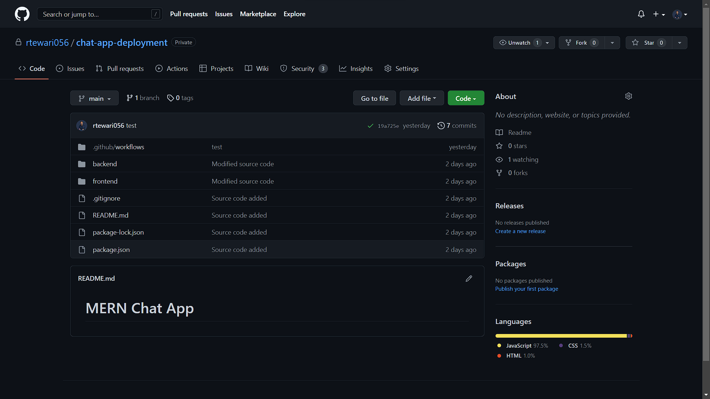
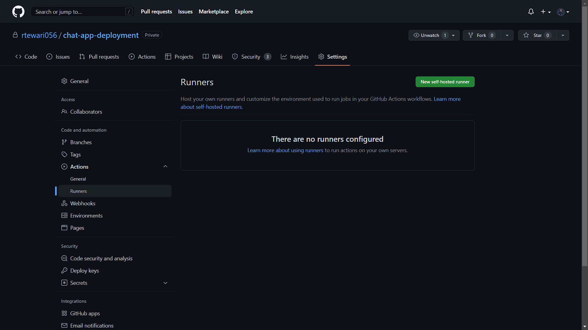
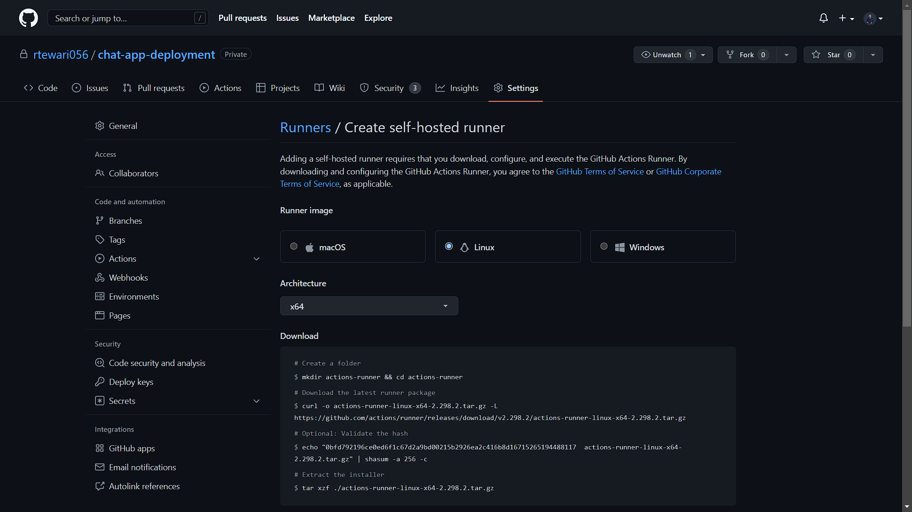
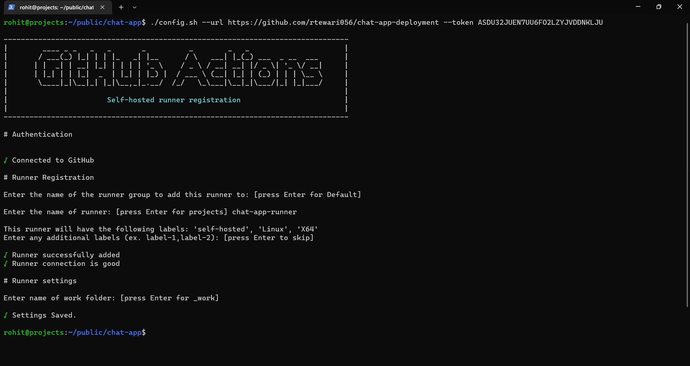
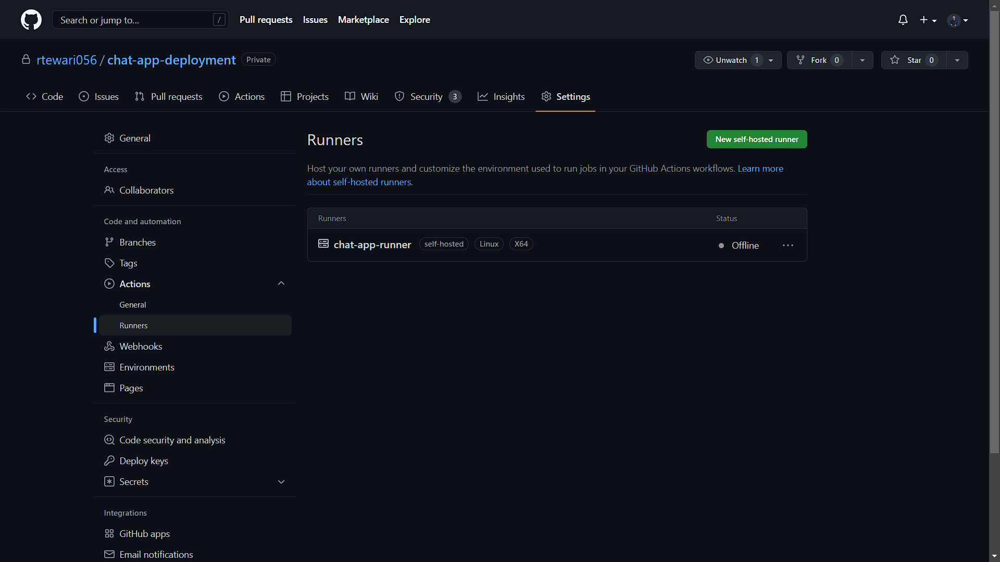
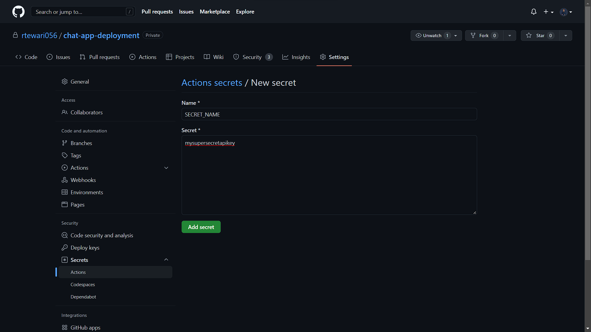
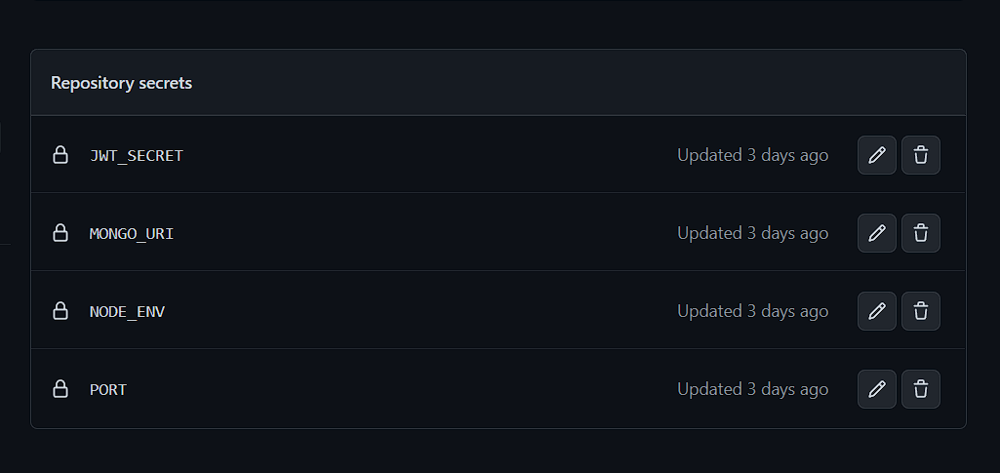

# Continuous Deployment to DigitalOcean

Auto deploy a MERN app to Digital Ocean platform using Continuous integration and Continuous delivery with GitHub Actions


## Step 1 - Create a new repository that will host your application on GitHub

In this step,we will head over to our GitHub account and create a new repository that will host our desired application. Follow [this](https://docs.github.com/en/free-pro-team@latest/github/getting-started-with-github/create-a-repo "Create a repository on GitHub") link to see steps on how to create a repository on GitHub.

In this case, I created one as shown below :



## Step 2 - Create & Configure A New DigitalOcean Server

Before we can do anything, we need to create and configure a VPS (Virtual Private Server) in the cloud to host our application.

To create a new droplet on DigitalOcean check out [this](https://github.com/rtewari056/digitalocean-deployment#step-1---create--configure-a-new-digitalocean-server "Create & Configure A New DigitalOcean Server") tutorial.

## Step 3 - Set up the Nginx, Node.js and PM2

To install and set up Nginx, Node.js and PM2 for our MERN project check out links below:

1. [Install & Configure Nginx](https://github.com/rtewari056/digitalocean-deployment#step-3---install--configure-nginx)
2. [Install Node.js](https://github.com/rtewari056/digitalocean-deployment#install-nodejs)
3. [Install PM2](https://github.com/rtewari056/digitalocean-deployment#install-pm2)

## Step 4 - Setup Continuous Deployment to DigitalOcean

With the deployment server set up and running, let's add a deployment workflow to push changes to the server automatically.

### Configure Self-hosted Runner

For deployment, we will be using the self-hosted runner option in the deployment workflow. For this example, the runner will be at a repository level hosted on the DigitalOcean Droplet that was set up in the previous section.  Go to the `Settings` > `Actions` > `Runners` section of the GitHub repository, then click the `New  self-hosted runner` button.



Since we have `Ubuntu` installed on the Droplet, select `Linux` as the runner image and `x64` as the architecture.



To integrate the `self-hosted` runner into your `Ubuntu` server, log in to your VPS via the terminal and follow the `Download` and `Configure` instructions provided in your `Settings` > `Actions` > `Runners` page.

On your local machine, SSH into your server. Use the following command to do so (substitute your username and IP address):

```bash
$ ssh USERNAME@SERVER_IP_ADDRESS
```

If you have too many keys on your local Machine, then you can try specifying which key you want to use:

```bash
$ ssh -i ~/.ssh/PRIVATE_KEY_FILE_NAME USERNAME@SERVER_IP_ADDRESS
```

Let’s started by creating a folder for our application:

```console
rohit@hostname:~$ mkdir your_project_name && cd your_project_name 
```

Download the latest runner package:

```console
rohit@hostname:~$ sudo curl -o actions-runner-linux-x64-2.298.2.tar.gz -L https://github.com/actions/runner/releases/download/v2.298.2/actions-runner-linux-x64-2.298.2.tar.gz
```
Extract the installer:

```console
rohit@hostname:~$ sudo tar xzf ./actions-runner-linux-x64-2.298.2.tar.gz
```

The `actions-runner-linux-x64-2.298.2.tar.gz` package won't be needed again, so let's delete it:

```console
rohit@hostname:~$ sudo rm actions-runner-linux-x64-2.298.2.tar.gz
```

Before going forward, we need to give the user full access permission to install and configure the runner inside current directory:

```console
rohit@hostname:~$ sudo chmod -R 777 <PATH_TO_YOUR_PRESENT_WORK_DIRECTORY>
```

Configure the runner:

```console
rohit@hostname:~$ ./config.sh --url https://github.com/GITHUB_USERNAME/GITHUB_REPO_NAME --token YOUR_TOKEN
```

You will be asked to enter some information to register your `self-hosted` runner with GitHub Actions.



Now go to the `Settings` > `Actions` > `Runners` section of your project repository.

If your `self-hosted` runner successfully registered, you will see your runner is currently offline.



Start the runner as a service:

```console
rohit@hostname:~$ sudo ./svc.sh install
rohit@hostname:~$ sudo ./svc.sh start
```

If you go to the `Settings` > `Actions` > `Runners` section of your project repository, you will see that `self-hosted` runner successfully is now successfully started.


### Configuring Nginx to display our project

The Nginx configuration is kept in the `/etc/nginx/sites-available` directory. To create a new configuration, let’s navigate to this directory and create a configuration file pointing to the server block of our Node.js application.

```console
rohit@hostname:~$ cd /etc/nginx/sites-available
rohit@hostname:~$ sudo nano myserver.config
```

Paste in the following configuration:

```bash
# The Nginx server instance
server {
    listen 80;
    server_name your_domain www.your_domain;

    location / {
        # Replace 8080 with the port number where your node js server is running
        proxy_pass http://localhost:8080;

        proxy_http_version 1.1;
        proxy_set_header Upgrade $http_upgrade;
        proxy_set_header Connection 'upgrade';
        proxy_set_header Host $host;
        proxy_set_header X-Real-IP $remote_addr;
        proxy_set_header X-Forwarded-For $proxy_add_x_forwarded_for;
        proxy_set_header X-Forwarded-Host $server_name;
        proxy_cache_bypass $http_upgrade;

        # Security Patches (Optional)
        server_tokens off;
        proxy_hide_header X-powered-by;
        proxy_hide_header X-Runtime;
        add_header X-XSS-Protection "1; mode=block";
        add_header X-Frame-Options "deny";
        add_header X-Content-Type-Options "nosniff";
    }
}
```

Save the file and exit the editor (`CTRL-X`+`Y`+`ENTER`).

For the next step, let’s enable the above file by creating a symbolic from it to the `sites-enabled` directory, which Nginx reads from during startup:

```console
rohit@hostname:~$ sudo ln -s /etc/nginx/sites-available/myserver.config /etc/nginx/sites-enabled/
```

The server block is now enabled and configured to return responses to requests based on the `listen` port and `location` path.

let’s check the status of Nginx to confirm that the configuration is working properly:

```console
rohit@hostname:~$ sudo nginx -t
```

The output upon running the above command would look like this:

```
nginx: the configuration file /etc/nginx/nginx.conf syntax is ok
nginx: configuration file /etc/nginx/nginx.conf test is successful
```

The above output confirms that our configuration was successful. Next, restart Nginx to enable your changes:

```console
rohit@hostname:~$ sudo systemctl restart nginx
```

### Create a GitHub Actions workflow file

Clone your project from GitHub in your local computer. Then create a directory named `.github` in the root directory of your project and create a subdirectory named `workflows` inside `.github` directory.

Now go to `.github` > `workflows` and create a file with any name you want but make sure it ends with `.js.yml` so `GitHub Actions` is able to recognize it. In my case, I will name the file as `deployment.js.yml`.

Paste in the following configuration inside `deployment.js.yml`:

```yml
# This workflow will do a clean installation of node dependencies, cache/restore them, build the source code and deploy the application
# For more information see: https://help.github.com/actions/language-and-framework-guides/using-nodejs-with-github-actions

name: Build & Deploy

# Controls when the workflow will run
on:
  push:
    branches: [ "main" ] # Will run on push to the "main" branch

jobs:
  build:

    runs-on: self-hosted # The type of runner that the job will run on

    # Steps represent a sequence of tasks that will be executed as part of the job
    steps:
    - uses: actions/checkout@v3
    - name: Use Node.js 18 # We can make it more understandable by adding names to the steps
      uses: actions/setup-node@v3.5.0
      with:
        node-version: '18.x' # Change according to the installed version
        cache: 'npm'
    
    - name: Install dependencies
      run: | 
        npm install
        cd frontend
        npm install

    - name: Creating a Production Build of React App
      run: | 
        npm run build
        cd ..
      
  create-envfile:
 
    runs-on: self-hosted
    needs: build # Run only after the 'build' job is completed
 
    steps:
    - name: Create .env file
      # Creates an '.env' file with environment variables
      run: |
        touch .env
        echo JWT_SECRET_KEY=${{ secrets.JWT_SECRET_KEY }} >> .env
        echo MONGO_URI=${{ secrets.MONGO_URI }} >> .env
        echo PORT=${{ secrets.PORT }} >> .env
        echo NODE_ENV=${{ secrets.NODE_ENV }} >> .env

  deploy:
 
    runs-on: self-hosted
    needs: [build, create-envfile] # Run only after the 'build' and 'create-envfile' job is completed
 
    steps:
    - name: Deploy to production 
      # Starts your node js app in 'PM2'
      run: |
        pm2 stop ecosystem.config.js
        pm2 start ecosystem.config.js
        pm2 save
```

If you are using `.env` file to use environment variables inside your project, you have to define `actions secrets` in your GitHub repository.

To define secrets, go to `Settings` > `Secrets` > `Actions` and click on `New repository secret` button. Then add your environment variable name and value inside the textarea.



After adding the secters it will look like this:



Along with that, we will also create a configuration file named `ecosystem.config.js` in our project root directory for `PM2` so we can easily `start/stop/restart` our `node js` application whenever we push changes to GitHub. You can name it anything but make sure it ends with `.config.js` so `PM2` is able to recognize it as a configuration file.

Paste in the following configuration inside `ecosystem.config.js`:

```javascript
module.exports = {
  apps: [
    {
      name: "chat-app",
      script: "./backend/server.js",
    },
  ],
};

```
Replace `chat-app` with your application name and `./backend/server.js` with the relative path of your node js entry point file.

Now everything is set up so, push the changes to GitHub to test if everything working as expected or not.

In your GitHub repository, go to `Actions` tab to see the workflows. If you see a `green check` then you have successfully deployed your app using `GitHub Actions`.